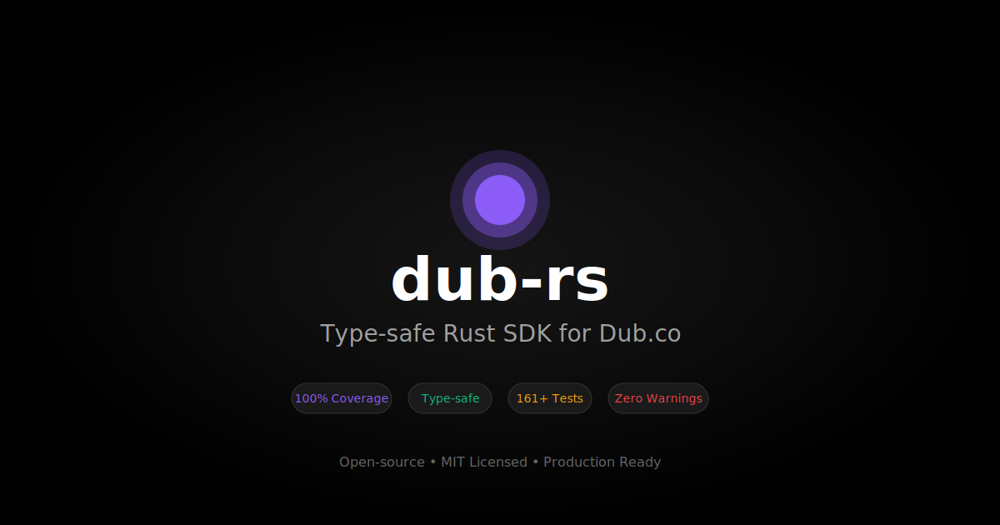

<p align="center">
  <a href="https://dub.co">
    
  </a>
</p>

<h3 align="center">dub-rs</h3>

<p align="center">
    The open-source Rust SDK for Dub.co
    <br />
    <a href="https://dub.co/docs"><strong>Learn more about Dub »</strong></a>
    <br />
    <br />
    <a href="#introduction"><strong>Introduction</strong></a> ·
    <a href="#features"><strong>Features</strong></a> ·
    <a href="#installation"><strong>Installation</strong></a> ·
    <a href="#contributing"><strong>Contributing</strong></a>
</p>

<p align="center">
  <a href="https://github.com/djnovin/dub-rs/actions/workflows/ci.yml">
    
  </a>
  <a href="https://crates.io/crates/dub">
    
  </a>
  <a href="https://github.com/djnovin/dub-rs/blob/main/LICENSE">
    
  </a>
  <a href="https://docs.rs/dub">
    
  </a>
</p>

<br/>

## Introduction

**dub-rs** is a complete, type-safe Rust SDK for the [Dub.co](https://dub.co) API – the modern link attribution platform for [short links](https://dub.co/home), [conversion tracking](https://dub.co/analytics), and [affiliate programs](https://dub.co/partners).

Built with **production-grade reliability**, featuring **100% API coverage**, **161+ tests**, and **zero warnings**.

## Features

- 🚀 **Complete API Coverage** – All 44 Dub.co endpoints across 12 resources
- 🔒 **Type-Safe** – Full compile-time type checking with serde integration
- ⚡ **Async/Await** – Built on tokio and reqwest for high-performance async operations
- 🎯 **Builder Patterns** – Ergonomic API with intuitive builder interfaces
- 🔄 **Automatic Retries** – Exponential backoff with configurable retry logic
- 📊 **Full Analytics** – Track clicks, leads, sales, and conversion metrics
- 💰 **Partner Program** – Complete affiliate management with commissions and payouts
- 🏆 **Bounty System** – Manage and approve bounty submissions
- 🧪 **Well-Tested** – 161+ comprehensive integration tests
- 📚 **Rich Documentation** – Complete API reference and usage examples

## Installation

Add this to your `Cargo.toml`:

```toml
[dependencies]
dub = "0.1"
tokio = { version = "1", features = ["full"] }
```

## Quick Start

```rust
use dub::{Dub, CreateLinkRequest};

#[tokio::main]
async fn main() -> Result<(), Box<dyn std::error::Error>> {
    // Initialize the client
    let client = Dub::new("your-api-key")?;
    
    // Create a short link
    let link = client.links()
        .create(CreateLinkRequest {
            url: "https://github.com/djnovin/dub-rs".to_string(),
            domain: Some("dub.sh".to_string()),
            key: Some("rust-sdk".to_string()),
            ..Default::default()
        })
        .await?;
    
    println!("Short link: {}", link.short_link);
    
    // Get analytics
    let analytics = client.analytics().get_link(&link.id).await?;
    println!("Total clicks: {}", analytics.clicks);
    
    // Track a conversion
    use dub::TrackLeadRequest;
    client.track().lead(TrackLeadRequest {
        click_id: "click_123".to_string(),
        event_name: "Sign Up".to_string(),
        customer_email: Some("user@example.com".to_string()),
        ..Default::default()
    }).await?;
    
    Ok(())
}
```

## API Coverage

<table>
  <thead>
    <tr>
      <th>Resource</th>
      <th>Endpoints</th>
      <th>Description</th>
    </tr>
  </thead>
  <tbody>
    <tr>
      <td><strong>Links</strong></td>
      <td>9</td>
      <td>Create, update, delete, upsert links with bulk operations</td>
    </tr>
    <tr>
      <td><strong>Analytics</strong></td>
      <td>7</td>
      <td>Retrieve clicks, leads, sales metrics with timeseries data</td>
    </tr>
    <tr>
      <td><strong>Domains</strong></td>
      <td>6</td>
      <td>Manage custom domains, check availability, transfer ownership</td>
    </tr>
    <tr>
      <td><strong>Tags</strong></td>
      <td>3</td>
      <td>Organize links with workspace tags</td>
    </tr>
    <tr>
      <td><strong>Workspaces</strong></td>
      <td>2</td>
      <td>Manage workspace information and settings</td>
    </tr>
    <tr>
      <td><strong>Customers</strong></td>
      <td>4</td>
      <td>Create and manage customer records for tracking</td>
    </tr>
    <tr>
      <td><strong>Events</strong></td>
      <td>1</td>
      <td>Track custom conversion events</td>
    </tr>
    <tr>
      <td><strong>Track</strong></td>
      <td>2</td>
      <td>Lead and sale conversion tracking</td>
    </tr>
    <tr>
      <td><strong>Partners</strong></td>
      <td>4</td>
      <td>Full partner/affiliate program management</td>
    </tr>
    <tr>
      <td><strong>Payouts</strong></td>
      <td>1</td>
      <td>List partner payouts with filtering</td>
    </tr>
    <tr>
      <td><strong>Commissions</strong></td>
      <td>3</td>
      <td>Create, update, and manage commissions</td>
    </tr>
    <tr>
      <td><strong>Bounties</strong></td>
      <td>3</td>
      <td>List, approve, and reject bounty submissions</td>
    </tr>
  </tbody>
</table>

**Total: 12 resources • 44 endpoints • 100% API coverage**

## Tech Stack

- [Rust](https://www.rust-lang.org/) – language
- [Tokio](https://tokio.rs/) – async runtime
- [Reqwest](https://github.com/seanmonstar/reqwest) – HTTP client
- [Serde](https://serde.rs/) – serialization
- [Chrono](https://github.com/chronotope/chrono) – datetime handling
- [GitHub Actions](https://github.com/features/actions) – CI/CD
- [Terraform](https://www.terraform.io/) – infrastructure as code

## Documentation

- **[API Reference](API_REFERENCE.md)** – Complete endpoint documentation
- **[Contributing Guide](CONTRIBUTING.md)** – How to contribute to this project
- **[Dub.co Docs](https://dub.co/docs)** – Official Dub.co documentation
- **[Examples](crates/dub/examples/)** – Code examples for all features

## Examples

```bash
# Basic link creation and analytics
cargo run -p dub --example basic

# Builder pattern usage
cargo run -p dub --example builder

# Comprehensive API showcase
cargo run -p dub --example comprehensive_api

# Partner program and commissions
cargo run -p dub --example partners

# Conversion tracking
cargo run -p dub --example tracking
```

## Contributing

We love our contributors! Here's how you can contribute:

- [Open an issue](https://github.com/djnovin/dub-rs/issues) if you believe you've encountered a bug
- Follow the [local development guide](#development-setup) to get your environment set up
- Make a [pull request](https://github.com/djnovin/dub-rs/pulls) to add new features/make improvements/fix bugs

All contributions must follow [conventional commits](https://www.conventionalcommits.org/) and include proper tests.

### Recommended Versions

| Tool  | Version |
| ----- | ------- |
| Rust  | 1.75+   |
| Cargo | 1.75+   |

### Development Setup

```bash
# Clone the repository
git clone https://github.com/djnovin/dub-rs.git
cd dub-rs

# Run tests
cargo test --workspace

# Run all CI checks
cargo fmt --all --check
cargo clippy --workspace --all-targets -- -D warnings
cargo test --workspace

# Build documentation
cargo doc --workspace --no-deps --open
```

### Project Structure

```
dub-rs/
├── crates/
│   ├── dub/           # Main SDK with ergonomic API
│   ├── dub-api/       # API types and models
│   └── dub-core/      # Core client and error handling
├── examples/          # Usage examples
├── .github/           # CI/CD workflows and templates
└── terraform/         # Infrastructure as code
```

### Running Integration Tests

```bash
# Set your API key
export DUB_API_KEY="your-api-key"

# Run tests
cargo test --workspace -- --nocapture

# Run specific test
cargo test -p dub-api --test links -- --nocapture
```

## Release Process

This project uses automated releases with semantic versioning:

1. Merge PRs to `main` with conventional commit messages
2. Create and push a version tag: `git tag v0.2.0 && git push origin v0.2.0`
3. GitHub Actions automatically:
   - Generates changelog from PRs
   - Creates GitHub release
   - Updates CHANGELOG.md
   - (Optional) Publishes to crates.io

See [Release Process Guide](.github/RELEASE_PROCESS.md) for details.

## License

Licensed under the [MIT License](LICENSE).

---

<p align="center">
  <a href="https://dub.co">
    
  </a>
</p>

<p align="center">
  Built with ❤️ for the <a href="https://dub.co">Dub.co</a> community
</p>
